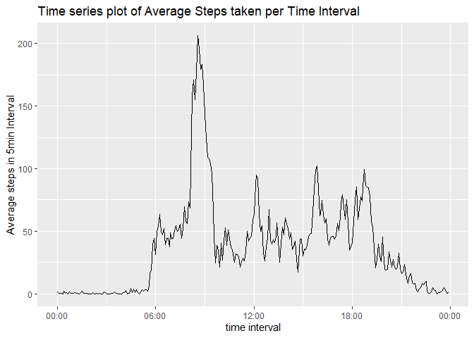
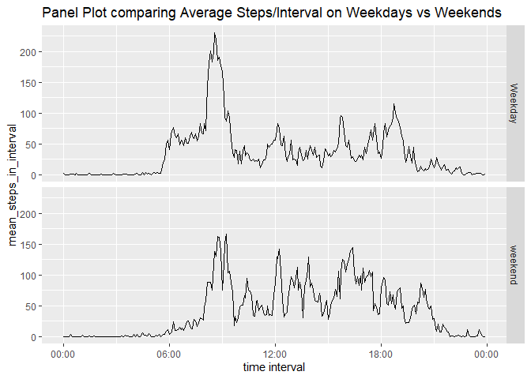

Author: Simon Hobbs  
Date: 28-Oct-2022

---


```r
library(dplyr)
```

```
## 
## Attaching package: 'dplyr'
```

```
## The following objects are masked from 'package:stats':
## 
##     filter, lag
```

```
## The following objects are masked from 'package:base':
## 
##     intersect, setdiff, setequal, union
```

```r
library(ggplot2)
library(stringr)
library(hms)
library(chron)

options(scipen=999)
```


# Loading and preprocessing the data

Read the CSV


```r
unzip("activity.zip")
df_data <- read.csv("activity.csv", colClasses = c("integer","character","integer"))
summary(df_data)
```

```
##      steps            date              interval     
##  Min.   :  0.00   Length:17568       Min.   :   0.0  
##  1st Qu.:  0.00   Class :character   1st Qu.: 588.8  
##  Median :  0.00   Mode  :character   Median :1177.5  
##  Mean   : 37.38                      Mean   :1177.5  
##  3rd Qu.: 12.00                      3rd Qu.:1766.2  
##  Max.   :806.00                      Max.   :2355.0  
##  NA's   :2304
```

Create column to represent datetime, and time


```r
df_data <- mutate(df_data, datetime = 
           as.POSIXct(
               paste(date, str_pad(interval, 4, pad='0')), 
               format="%Y-%m-%d %H%M", tz="UTC" 
                   )
       )  

df_data$time <- as_hms(df_data$datetime)
```


# What is mean total number of steps taken per day?


```r
df_summary <- df_data %>% 
    group_by(date) %>% 
    summarise(daily_steps = sum(steps,na.rm=TRUE))

g <- ggplot(df_summary, aes(daily_steps)) + 
    geom_histogram(bins = 20) +
    labs(title="Histogram of Daily Steps")

print(g)
```

<!-- -->

```r
summary(df_summary)
```

```
##      date            daily_steps   
##  Length:61          Min.   :    0  
##  Class :character   1st Qu.: 6778  
##  Mode  :character   Median :10395  
##                     Mean   : 9354  
##                     3rd Qu.:12811  
##                     Max.   :21194
```


```r
mean_steps_per_day <- mean(df_summary$daily_steps)
median_steps_per_day <- median(df_summary$daily_steps)
```

**Mean steps per day = 9354.2295082.**

**Median steps per day = 10395.**


# What is the average daily activity pattern?


```r
df_intervalsummary <- df_data %>% 
    group_by(time) %>% 
    summarise(mean_steps_in_interval = mean(steps, na.rm=TRUE))

summary(df_intervalsummary)
```

```
##      time          mean_steps_in_interval
##  Length:288        Min.   :  0.000       
##  Class1:hms        1st Qu.:  2.486       
##  Class2:difftime   Median : 34.113       
##  Mode  :numeric    Mean   : 37.383       
##                    3rd Qu.: 52.835       
##                    Max.   :206.170
```

```r
g <- ggplot(df_intervalsummary, aes(as.POSIXct(time), mean_steps_in_interval)) +
    geom_line() +
    scale_x_datetime(name = 'time interval', date_labels = "%H:%M") +
    labs(title="Time series plot of Average Steps taken per Time Interval") +
    labs(y = "Average steps in 5min Interval")

print(g)
```

<!-- -->


```r
df_temp <- df_intervalsummary[which.max(df_intervalsummary$mean_steps_in_interval),]

interval <- format(df_temp[[1]], "%H:%M")
```

**The 5-minute interval containing the maximum number of steps is 08:35:00.  **  

**This interval contains (on average) 206.1698113 steps.  ** 


# Imputing missing values

**Q1. The total number of missing entries is 2304.** 

Q2. I will impute the missing values, based on the following strategy:  
- For any missing entry of 'steps', set it to the mean value for that 5-min
interval, averaged across the dataset. 

Q3. I will now create the new dataset and call it df_data_imputed:


```r
# Create a new dataframe that's a copy of df_data, but it's got an extra column
# 'mean_steps_in_interval', looked up based on the interval (time). 
# We'll use that later. 

df_data_imputed <- merge(df_data, df_intervalsummary, sort=FALSE, all.x=TRUE)

# Find out which rows have NA for steps
missing_row_indices <- which(is.na(df_data_imputed$steps))

# For each row which has NA for steps, use the mean_steps_in_interval value.
for (i in missing_row_indices) {
    df_data_imputed$steps[i] <- df_data_imputed$mean_steps_in_interval[i]
}

# Drop the mean_steps_in_interval column    
df_data_imputed <- df_data_imputed %>% select(!mean_steps_in_interval)
```

Q4. Here's a histogram of the dataset after imputation:


```r
df_summary_imputed <- df_data_imputed %>% 
    group_by(date) %>% 
    summarise(daily_steps = sum(steps,na.rm=TRUE))

g <- ggplot(df_summary_imputed, aes(daily_steps)) + 
    geom_histogram(bins = 20) +
    labs(title="Histogram of Daily Steps")

print(g)
```

<!-- -->

```r
summary(df_summary_imputed)
```

```
##      date            daily_steps   
##  Length:61          Min.   :   41  
##  Class :character   1st Qu.: 9819  
##  Mode  :character   Median :10766  
##                     Mean   :10766  
##                     3rd Qu.:12811  
##                     Max.   :21194
```

Q4 (continued). Now let's calculate & report the mean & median values:


```r
mean_steps_per_day_imputed <- mean(df_summary_imputed$daily_steps)
median_steps_per_day_imputed <- median(df_summary_imputed$daily_steps)
```

**Mean steps per day = 10766.1886792.**

**Median steps per day = 10766.1886792.**


```r
df_table <- data.frame(
    imputation = c("None", "Imputed", "Diff"),
    mean_steps_per_day = c(
        mean_steps_per_day, 
        mean_steps_per_day_imputed, 
        mean_steps_per_day_imputed - mean_steps_per_day),
    median_steps_per_day = c(
        median_steps_per_day, 
        median_steps_per_day_imputed, 
        median_steps_per_day_imputed - median_steps_per_day)
    )


df_table
```

```
##   imputation mean_steps_per_day median_steps_per_day
## 1       None           9354.230           10395.0000
## 2    Imputed          10766.189           10766.1887
## 3       Diff           1411.959             371.1887
```

We can see that with Imputation, the mean & median number of steps per day increases.  
This makes sense, since we have added steps in!  

The last row of the table above shows the impact of Imputation on the mean & median.  
Imputation adds 1411.959171 steps to the MEAN, and 371.1886792 to the MEDIAN.


# Are there differences in activity patterns between weekdays and weekends?

I'll now create a factor variable called "daytype" for 'weekday' or 'weekend': 


```r
df_data_imputed$daytype <- factor(1*is.weekend(df_data_imputed$datetime), 
                                  labels=c("Weekday","weekend"))
```

I'll now group by daytime, and then average the steps within each 5min interval:


```r
df_intervalsummary_imputed <- df_data_imputed %>% 
    group_by(daytype, time) %>% 
    summarise(mean_steps_in_interval = mean(steps, na.rm=TRUE))
```

```
## `summarise()` has grouped output by 'daytype'. You can override using the
## `.groups` argument.
```

```r
summary(df_intervalsummary_imputed)
```

```
##     daytype        time          mean_steps_in_interval
##  Weekday:288   Length:576        Min.   :  0.000       
##  weekend:288   Class1:hms        1st Qu.:  2.047       
##                Class2:difftime   Median : 28.133       
##                Mode  :numeric    Mean   : 38.988       
##                                  3rd Qu.: 61.263       
##                                  Max.   :230.378
```

```r
g <- ggplot(df_intervalsummary_imputed, 
            aes(as.POSIXct(time), mean_steps_in_interval)) +
    facet_grid(daytype ~ .) + 
    geom_line() +
    scale_x_datetime(name = 'time interval', date_labels = "%H:%M") +
    labs(title="Panel Plot comparing Average Steps/Interval on Weekdays vs Weekends")

print(g)
```

<!-- -->
